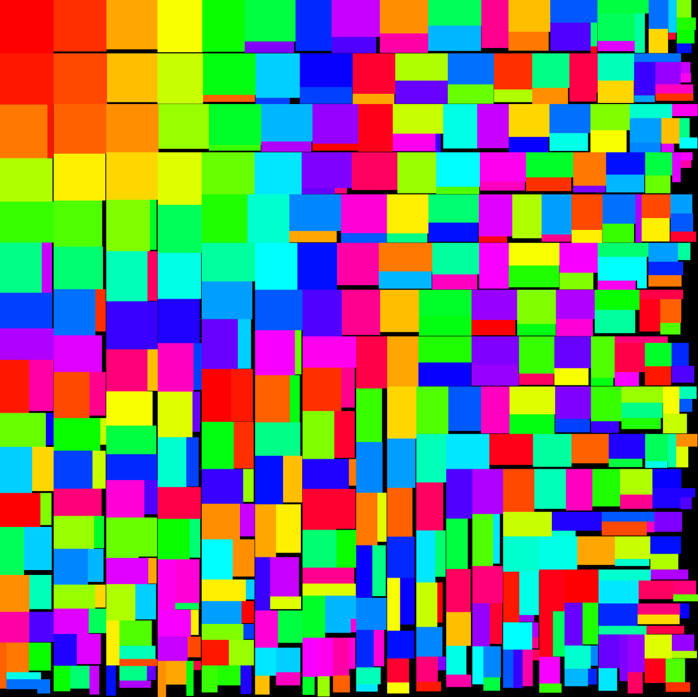

# RectpackSharp
A rectangle packing library made in C# for .NET Standard.

Loosely based on the well-known C++ [rectpack-2D library](https://github.com/TeamHypersomnia/rectpack2D)

This started as a side-project for the [TrippyGL graphics library](https://github.com/ThomasMiz/TrippyGL) but as it grew, I decided to give it it's own repository and open the project for everyone to use.

The libary is quite small, so you can even just chuck the files directly onto your project if you don't want additional DLLs!

## Usage

Once you have the library, just add ``using RectpackSharp`` to access the library types.

You will see the ``PackingRectangle`` type and the ``RectanglePacker`` static class.

Create a ``PackingRectangle`` for each rectangle you want and put them all in a single array. You can identify your rectangles using the ``PackingRectangle.Id`` field. Afterwards, just call ``RectanglePacker.Pack``. That's it!

```cs
PackingRectangle[] rectangles = new PackingRectangle[amount];
// Set the width and height of your rectangles
RectanglePacker.Pack(rectangles, out PackingRectangle bounds);
// All the rectangles in the array were assigned X and Y values. Bounds contains the width and height of the bin.
```

Specifying no extra parameters means the library will try all it's tools in order to find the best bin it can. If performance is important, you can trade space efficiency for performance with the optional parameters:

* ``packingHint`` allows you to specify which methods to try when packing.
* ``acceptableDensity`` makes the library stop searching once it found a solution with said density or better.
* ``stepSize`` is by how much to vary the bin size after each try. Higher values might be faster but skip possibly better solutions.

So for example, if you know all your rectangles are squares, you might wanna try
```cs
RectanglePacker.Pack(rectangles, out PackingRectangle bounds, PackingHint.Width, 1, 1);
```

## Need Help?
Feel free to come ask questions over at the [TrippyGL Discord server](https://discord.gg/3j5Q4zN)!

## Gallery

Here's a test case where the rectangles have relatively similar dimentions.


In this test case, all the squares are the same size. Currently, the library doesn't handle the edges very well on these cases.


It also works like a charm for texture atlases or sprite sheets!


The most complicated cases are when the rectangles have very irregular dimentions, because there's no good answer to "what to put where".
For these next test cases, we simply generated 512 or 2048 random rectangles (each side being from 20 to 200) and packed them.



Fuck it, here's 65536 random rectangles in a ~24k x 24k bin.

